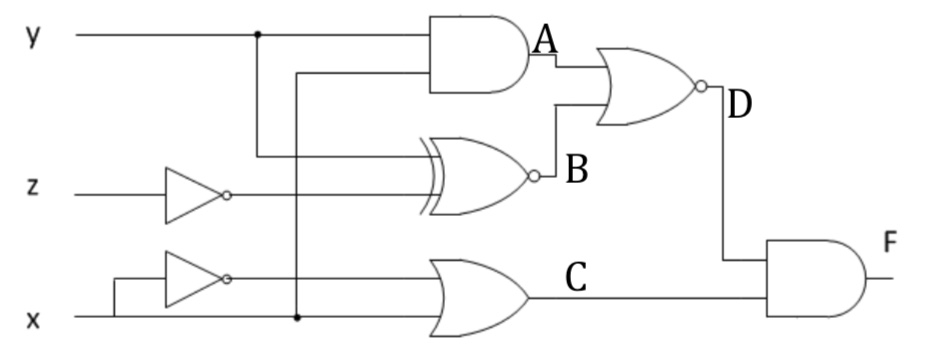
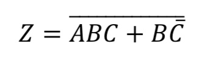
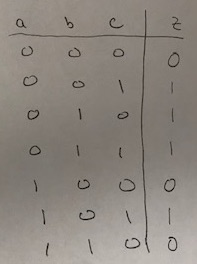

## Homework #01

#### Hardware Abstractions

1. Name a non-computing related abstraction that you use in the real world and give a few complete sentences explaining why it is an abstraction.

1. Give a few complete sentences describing a system (different from the one given in class) in which a hierarchy of abstractions is used in the real world.  Clearly identify the gap that is being bridged by these abstractions.

1. Watch the videos linked on the course web page for this class and for the first lab.  The supplemental reading on Moodle may help as well. Name the three switching technologies that have been used in the creation of electronic computers in the order in which they were used.

1. What advantages did each switching technology have over the one that it replaced?

#### Transistors to Logic Gates

1. Use LogicSim to build and simulate a circuit that uses an N-Type and a P-Type transistor to build the NAND gate, as was shown in class. Control the input to the gate using a button and show the output using an LED.  Include a screen shot of your circuit in your homework submission.

1. Fill in the blanks below using "open" or "closed" to create true statements:
   1. An N-type transistor acts like a(n) `______________` switch when its gate has a positive voltage (i.e. logical 1).
   1. A P-type transistor acts like a(n) `______________` switch when its gate is grounded (i.e. logical 0).

1. Give a truth table for the Boolean function implemented by the circuit shown below.
   

1. Using what you know about N-Type and P-Type transistors, design a circuit that computes the AND function of two inputs.  This can be done with 3 N-Type and 3 P-Type transistors. Draw a schematic diagram for your circuit using the heuristic (switch-like) symbols from class.

1. Use LogicSim to build your AND gate from the previous question. Control the inputs to the gate using DIP switches and show the output using an LED. Simulate your AND gate to confirm that it properly implements the AND gate. Include a screen shot of the circuit in your homework submission.

1. Give the schematic symbol, logic expression and truth table for each of the following logic gates (you do not have to implement them). Use the style and notation that we have used in class.
   1. NOR
   1. XOR
   1. XNOR

#### Logic Gates to Logic Circuits

1. Consider the Boolean function F implemented by the circuit shown below. Note: This circuit contains an XNOR gate.
   

   1. Give a logic expression for the Boolean function F.
   1. Give a truth table for the Boolean function F.

1. Use LogicSim to build the circuit from the previous question. Control the inputs to the circuit using DIP switches and show the output using an LED. Simulate your circuit to confirm that it properly implements the function. Include a screen shot of the circuit in your homework submission.

1. Consider the Boolean function Z expressed as a logic expression shown below:  

   

   1. Give a truth table for the Boolean function Z.
   1. Draw a logic circuit that implements the Boolean function Z.

1. Use LogicSim to build the circuit from the previous question. Control the inputs to the circuit using DIP switches and show the output using an LED. Simulate your circuit to confirm that it properly implements the function. Include a screen shot of the circuit in your homework submission.

1. Consider the Boolean function Z represented as a truth table shown below:

   

   1. Give a logic expression for the Boolean function Z.
   1. Draw a logic circuit that implements the Boolean function Z.

1. Use LogicSim to build the circuit from the previous question. Control the inputs to the circuit using DIP switches and show the output using an LED. Simulate your circuit to confirm that it properly implements the function. Include a screen shot of the circuit in your homework submission.
