## Homework #02

#### Simplifying Logic Circuits

1. Use truth tables to show that DeMorgan's And and Or Boolean identities are valid.

1. Apply DeMorgan's Identities to the following expressions:
   1. 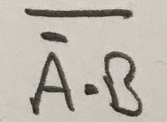

   1. 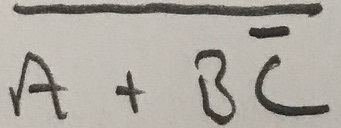

   1. 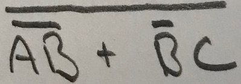

1. Recall from Class 04 the logic circuit and corresponding expression below:
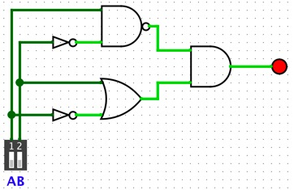
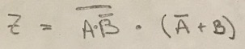

Also recall that we used the Boolean Identities to show that the above expression (and thus the circuit also) could be simplified (steps omitted here - see the Class04 slides):
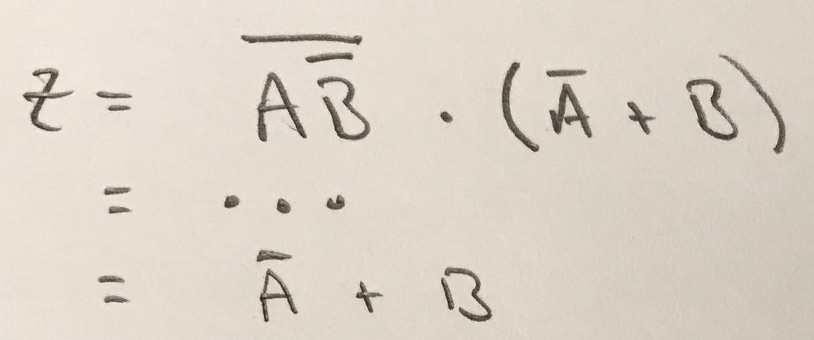

Use the Boolean Identities to show that this expression could also be simplified to:
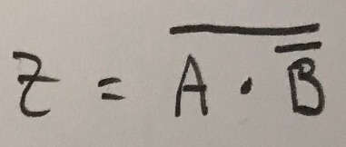

Hint: Try starting from end result above and applying another identity.

1. Use Boolean Identities to simplify the following Logic Expressions.
   1. 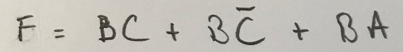

   2. 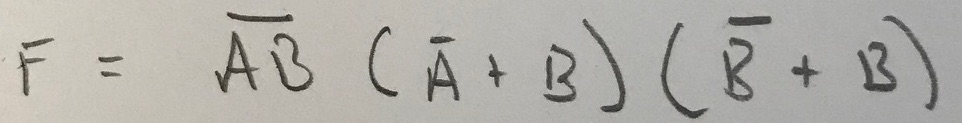

1. A set of gates is called _universal_ if they are sufficient to implement any Boolean function. Any Boolean function can be represented as a truth table by simply listing the output for all possible combinations of the inputs.  We saw in class that if we create a truth table, we can then create an SOP expression and from that expression build a circuit for it using just AND, OR and NOT gates.  Thus, the set of gates {NOT, AND, OR} is universal.

   That may not be too surprising, but what might be more surprising is that NAND by itself is universal (note: NOR is as well). One way to show that NAND is universal is to show that we can build NOT, AND and OR using only NANDs.  Show NAND is universal by constructing circuits using only NAND that compute:

   1. `NOT`
   1. `AND`
   1. `OR`

#### Bits/Bytes/Words and Integers

1. Give the base 10 value of the following 8-bit binary numbers if interpreted as a) Unsigned Binary, b) Sign Magnitude and c) Two's Complement.
   1. `0100 1101`
   1. `1101 0110`

1. Give the 8-bit binary value of the following decimal numbers using a) Unsigned Binary (if possible), b) Sign Magnitude and c) Two's Complement.
   1. `120`
   1. `-83`

1. Perform the following addition of 8-bit binary numbers.
   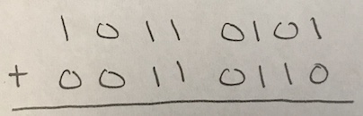

1. Check the answers to the previous question to see if they yield the correct base 10 result if the values are in a) Unsigned Binary, b) Sign Magnitude, c) Two's Complement representation.  For each representations indicate if the the binary addition gave the correct result.

1. Give the binary and base 10 values of the most positive and most negative (or non-positive) numbers that can be represented in 8-bits using a) Unsigned Binary, b) Sign Magnitude and c) Two's Complement.

1. Give an expression in terms of `n`, the number of bits being used, for the largest and smallest values that can be represented using a) Unsigned Binary, b) Sign Magnitude and c) Two's Complement.  For example, the largest Unsigned Binary value representable in `n` bits is (2^n)-1  (2 raised to the n, minus 1). Your results here should agree with your answers to the previous question for n=8.

1. In our first class meeting we saw some surprising program outputs related to signed integers (e.g. 'failure1' and 'failure2').  This question sets out to understand those failures.

   We typically treat the `int` datatype in Java (and other languages as well) as an abstraction of a mathematical Integer.  However, while Mathematical Integers can get arbitrarily large `int` values in Java (and C/C++/ect.) cannot.  They are represented using 32-bit Two's Complement representation, and from prior questions you know that the range of representable values is limited by the number of bits.

   When the value goes outside of that range our abstraction fails and the behavior is surprising.  Understanding what underlies that abstraction is the only way to understand the surprising behavior.

   1. Investigating `failure1`: The code for `failure1` was:
      ```java
      int x = 1;
      while (x > 0) {
        x++;
      }
      System.out.println("Done!");
      ```
      1. Write down (in binary) the largest positive number that can be represented in 32-bit Two's Complement.
      1. Use binary addition to add 1 to the your previous answer.
      1. Is the result of that addition positive or negative?
      1. What is its base 10 value?
      1. Modify the `failure1` program to print the value of `x` instead of `Done`.  What value is printed?
      1. Why doe the `while` loop terminate?

   1. Investigating `failure2`: The lines of `failure2` that are most relevant here are:
      ```java
      System.out.println(Integer.MIN_VALUE);
      System.out.println(Math.abs(Integer.MIN_VALUE));
      ```
      1. Write down (in binary) the largest negative number that can be represented in 32-bit Two's Complement.
      1. Take the Two's Complement of that number (i.e. flip the bits and add 1).
      1. What happens?
      1. How does this behavior explain the results of `failure2`?

1. Some silly fun with Binary Coded Decimals and Hexadecimal.
   1. The clock below uses binary to represent the time in HH:MM:SS format.  

      

      What time is it?

   1. Watch this [short clip](https://www.youtube.com/watch?v=QUYKSWQmkrg) from the movie "The Sixth Sense". Assuming the boy is talking in unsigned binary represented as hexadecimal, how many people (in base 10) does he see?  Hint: Pay close attention about 26-30 seconds in.

#### Arithmetic and Social/Legal/Ethical Issues

1. Perform the following additions on 8-bit binary numbers.  For each, indicate if overflow has occurred if the numbers are a) unsigned, b) Two's Complement.

   1. 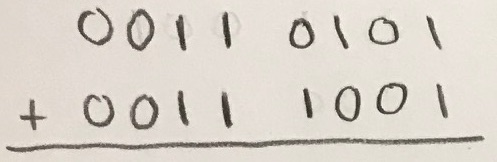

   1. 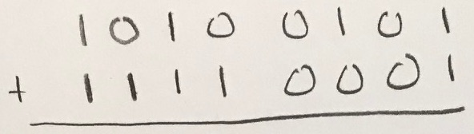

   1. 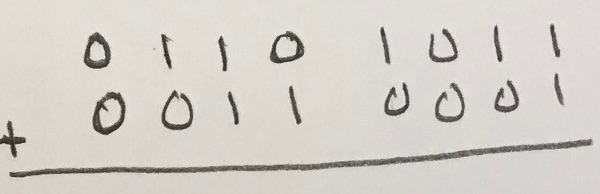

   1. 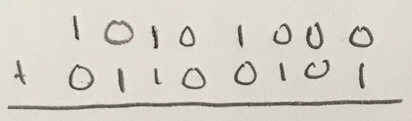

1. In class (in the Google Sheet on Moodle) we saw examples of 4-bit binary addition where different combinations of Carry Out of 1 and Overflow occurred.  In all of those examples the computed result was incorrect in Sign Magnitude. Give an example of a 4-bit addition using non-zero values where the computed result is correct for all three representations (Unsigned, Sign Magnitude, and Two's Complement).

1. We have discussed binary addition, but not subtraction.  The reason being that with two's complement numbers subtraction is unnecessary. Recall from mathematics that A - B can be rewritten as A + (-B).  Thus, subtraction can be performed by taking the complement of subtrahend and then doing addition.  Use this property to perform the following subtractions of 8-bit two's complement numbers.

   1. 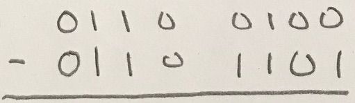

   1. 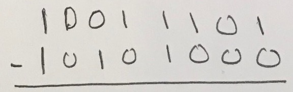

1. In designing a new processor the engineers decide that it would be a good idea to have a circuit that detects when overflow occurs in the addition of two's complement numbers. This circuit will take as inputs MSbA, MSbB (the MSb's of the two numbers being added) and MSbC (the MSb of the result of the addition).  Give a truth table for a logic function V that given MSbA, MSbB, MSbC indicates if overflow has occurred (V=1) or not (V=0).  It is not necessary for this question, but it should be apparent that with the truth table in hand, an SOP expression and a circuit could be generated.

1. Most high-level programming languages provide _bitwise_ operators.  These operators manipulate the underlying bits used to represent the values. For example, `~` is the bitwise NOT operator in Java. This operator flips all of the bits in the variable to which it applies.  E.g. `y = ~x` will flip the bits in the value of `x` and put the result into `y`.  

   1. What value will be output by the following snippet of code?
      ```Java
      byte x = 47;
      byte y = ~x + 1;
      System.out.println(y);
      ```

   1. What value will be output by the following snippet of code?
      ```Java
      byte x = 47;
      byte y = 22;
      byte z = x + (~y + 1);
      System.out.println(z);
      ```

1. Java has two other bitwise operators `&` is the bitwise AND operator, and `|` is the bitwise OR operator.  When applied to two operands these operators compute their result by applying the logical operator to the corresponding bits of the operands.  Read a little about [the Java Bitwise operators](https://www.geeksforgeeks.org/bitwise-operators-in-java/) and answer the following questions:

   1. What value will be output by the following snippet of code?
      ```Java
      byte x = 22;
      byte y = x & 12;
      System.out.println(y);
      ```

   1. What value will be output by the following snippet of code?
      ```Java
      byte x = 22;
      byte y = x | 12;
      System.out.println(y);
      ```

1. What is the _Y2K38_ bug?  Scan some web pages that come up when you search for this term and find one that you find readable (some will be loaded with technical jargon, others will be easier to understand.)  Then summarize, in your own words, what the _Y2K38_ bug is and how it is related to what we have been studying.
