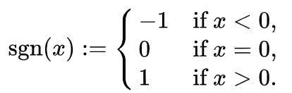

## Homework #06

#### Branching and Looping

Give an assembly language implementation that is equivalent to each of the following high level language programs.

   1. A program that rounds an integer up to the next closest even integer.
      ```
      int x;
      Read x;
      if (x % 2 != 0) {  // if x is odd.
         x++;
      }
      Print x;
      ```

   1. A program that computes the whole number part of the log base 2 of an integer.  The log base 2 of a number is the number of times that it can be divided by 2 before reaching the value 1.  One way to do this is to use integer division and count how many times the number can be divided by 2 before getting a result that is less than or equal to 1.  Hint: The `SHR` operation should help you here.
      ```
      int a;
      int log = 0;

      Read a;
      while (a > 1) {
        log++;
        a = a / 2;   // Integer division by 2.
      }

      Print log;
      ```

   1. A program that reads a specified number of positive integers from standard input and prints out the largest value read.
      ```
      int n;
      int max = 0;

      Read n;
      for (int i=0; i<n; i++) {
         Read j;
         if (j > max) {
             max = j;
         }
      }
      Print max;
      ```

   1. A program that computes the sign function of a provided value:

      

      ```
      int x;

      Read x;

      if (x < 0) {
         Print -1;
      }
      else if (x == 0) {
         Print 0;  
      }
      else {
         Print 1
      }
      ```

#### Arrays and Indirect Addressing

1. Consider the following HLL program statements that allocate arrays:
   ```
   int p[] = new int[50];
   int q[] = {10, 20, 30, 50, 60};
   ```
   1. Give assembly language statements that will allocate these arrays and the references to them.
   1. Give assembly language instructions that will set the values of the references to the arrays.
   1. Assuming the symbol table below, draw a picture of the physical array implementation in memory (use the pictures in the slides as an example).
      ```
      Symbol      Address
      --------------------
      P           150
      PARR        400
      Q           154
      QARR        200
      ```

1. Consider the following assembly language code that creates an array and the reference to it.  Assume also that the assembler has used the given symbol table.
   ```
   T:      .word                        Symbol      Address
   TARR:   .word 1 9 3 2 5 4            --------------------
                                        T           350
           LOAD R0 #TARR                TARR        354
           STORE R0 T
   ```
   1. For each of the following assembly language instructions, indicate the addressing mode that it is using and give the value that will be loaded into `R1`:
      1. `LOAD R1 #5`
      1. `LOAD R1 T`
      1. `LOAD R1 #T`
      1. `LOAD R1 TARR`
      1. `LOAD R1 #TARR`
      1. `LOAD R1 R0`
      1. `LOAD R1 R0 +16`
      1. `LOAD R1 R0 +2`

   1. Give assembly language instructions that implement each of the following high level language operations on the array `t`.
      1. `T[0] = 10`
      1. `T[5] = T[1]`
      1. `T[1] = T[T[3]]`
      1. Swap the values in `T[0]` and `T[5]`

1. Consider the following assembly language code that creates an array and the reference to it.
   ```
   M:      .word
   MARR:   .word 10 20 30 40 50 60 70

           LOAD R0 #TARR
           STORE R0 T
   ```
   1. Give the values that will be stored in `R5`, `R6`, `R7` and `R8` after the following instructions would execute:
      ```
      ADD R0 R0 #4
      LOAD R5 R0
      ADD R0 R0 #4
      LOAD R6 R0
      ADD R0 R0 #4
      LOAD R7 R0
      ADD R0 R0 #4
      LOAD R8 R0
      ```

   1. The answer to the previous question should give some insight into how you could use a loop to go through the elements of an array. Above `R0` initially held the address of the first element of the array (i.e. `M[0]`). Register indirect addressing mode was then used to set `R5 = M[0]`.  When `4` was added to `R0` it then held the address of the second element of the array (i.e. `M[1]`).  Similarly, each time `4` was added to `R0` the address became that of the next element in the array.  This idea can be adapted for use in a loop to go through all of the elements in an array by adding `4` to the address being used each time.

      Write an assembly language program that uses a loop to add 1 to each of the values in the array `M`.  Assemble and run your program to be sure that it works. When you run the program, you will find the values in the array in the memory just after the `HALT` instruction (All `1`s).

1. Write an assembly program that computes the first 20 Fibonacci numbers. In a high level language this program might be something like:
   ```
   int[] fib = new int[30];

   fib[0] = 1
   fib[1] = 1

   for (int i=2; i < 20; i++) {
      fib[i] = fib[i-1] + fib[i-2];
   }
   ```

   Assemble and run your program on our machine to ensure that it works.  When you run the program, you will find the array of Fibonacci numbers in the memory just after the `HALT` instruction.

<!--
1. You may have noticed that although all of our array programs create a reference to the array, as is done in Java, we haven't actually needed them.  So a logical question would be why bother?  

   Consider the following HLL program:
   ```
   int[] x = {1, 2, 3, 4, 5};
   int[] y = {2, 4, 6, 8, 10};
   int a;

   Read a;

   if (a > 0)
      x = y;

   Print x[1];
   ```

   It is impossible to know if this program will print `2` or `4` until after it is run.  Thus,
-->

#### Functions and Parameters

1. Coming soon.
